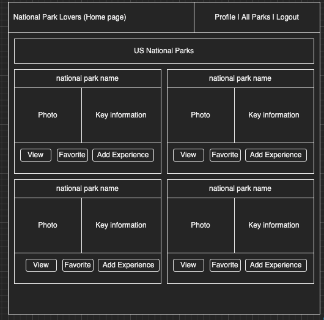

# NATIONAL PARK EXPERIENCES

## App Description
Users will be able to view all US national parks, add parks to their favorites list, write entries on their experiences in a national park, and read other user's experiences. 

## API
I will use the US National Park Services API - https://www.nps.gov/subjects/developer/api-documentation.htm#/amenities/parksplaces/getAmenitiesParksplaces.

## User stories
- As a user, I want to view a list of US national parks
- As a user, I want to see specific details about any given national park
- As a user, I want to add national parks to my favorites list
- As a user, I want to document my experiences at a national park. 
- As a user, I want to read other users' experiences
- As a user, I want to be able to view my profile, my favorited national parks, and my written experiences

## ERD

## Wire Frames
### Home page - List of all National Parks

### Park page - individual park

## RESTful routes

### Users
| HTTP METHOD (_Verb_) | URL (_Nouns_)            | CRUD | Response                                       | Notes |
| -------------------- | -------------            | ---- | --------                                       | ----- |
| GET                  | /users/new               | R    | a form for creating a new user                 |       |
| POST                 | /users               | C    | create new user                                |       |
| GET                  | /users/:profile               | R    | show user's profile                            |       |
| GET                  | /users/:profile/edit               | R    | a form for editing the user's profile                            |       |
| PUT                  | /users/:profile               | U    | edit the user's profile                        |       |
| GET                  | /users/login               | R    | show a login form                         |       |
| POST                  | /users/login               | C    | accept a payload of form data and use it to login the user                         |       |
| GET                  | /users/logout               | R    | logout a user by clearing the stored cookie                    |       |

### National Parks
| HTTP METHOD (_Verb_) | URL (_Nouns_)            | CRUD | Response                                          | Notes |
| -------------------- | -------------            | ---- | --------                                          | ----- |
| GET                  | /parks                   | R    | show all national parks                           |       |
| GET                  | /parks/:parkCode               | R    | show a specific national park and all experiences |       |
| POST                 | /parks/:parkCode/favorite    | C    | add to favorites list                             |       |
| DELETE               | /parks/favorite/:parkCode     | D    | remove from favorites list                        |       |

### Experiences
| HTTP METHOD (_Verb_) | URL (_Nouns_)            | CRUD | Response                                              | Notes |
| -------------------- | -------------            | ---- | --------                                              | ----- |
| GET                  | /experiences             | R    | display all user experiences  |       |
| GET                  | /experiences/new/:parkCode             | R    | show form to write an experience about a national park  |       |
| POST                 | /experiences/new/:parkCode         | C    | a new experience is created                           |       |
| GET                  | /experiences/edit/:experienceId         | R    | show a form to edit or delete an experience                            |       |
| PUT                 | /experiences/edit         | U    | update an experience                                  |       |
| DELETE               | /experiences/delete         | D    | delete an experience                                  |       |

## MVP
- Set up sequelize ORM models and tables
- Connect API to US gov national park database
- Set up express package to create servers and controllers
- Set up routing using RESTful principles
- Clean HTML, CSS, and back-end code
- Deploy online

## Stretch Goals
- Add a favorite counter for each park
- User can update their password
- Add activities to do in each park
- Unfavorite a park
- Count of favorites for each park
- Visited button and table

## todo list:
- Park page shows experiences written about that park
- create a carosel for the homepage
- add an unfavorite button and logic
- unfavorite a national park - need to do a join on the favorite table 

